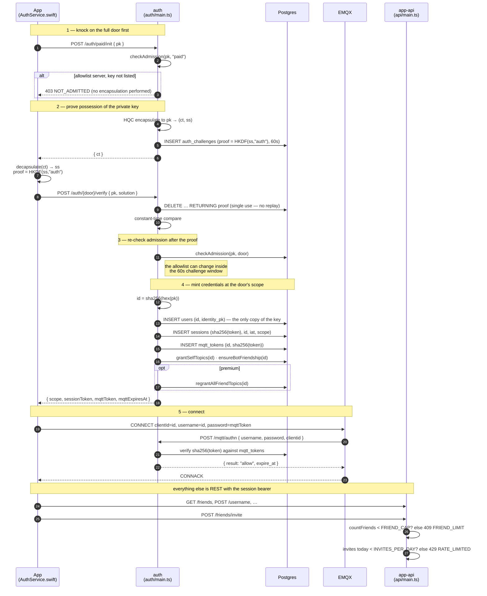

# Authentication

How a client goes from "I hold a private key" to "I have a live MQTT session",
what it is allowed to do when it gets there, and what each component is trusted
with along the way.

Nothing here is a password. Identity is an HQC key pair generated on the device;
the server never sees the private half, and "logging in" means proving you can
decapsulate a ciphertext addressed to your public key.

## Two doors

There are two ways in, and they are separate endpoints rather than one endpoint
with a flag:

| | `/auth/free/*` | `/auth/paid/*` |
|---|---|---|
| Who gets in | anyone holding a key pair | anyone holding a key pair |
| Refused with | — | `403 NOT_ADMITTED`, on an `allowlist` server only |
| Session scope | `free` | `premium` |
| Can do | talk to the helper bot | everything, including adding contacts |

**The full door is not a paywall and its name is historical.** It used to admit
only a key bound to a live subscription and refuse everything else with
`402 NOT_CLAIMED` before spending an encapsulation. The product is free and
donation-funded now, so on the default `open` policy both doors admit anyone who
proves key possession. The wire name stays `paid` because the apps, the bot and
every deployed server speak it, and renaming a live path buys nothing but a
migration.

The split survives the paywall because it still earns its keep: the free door is
what a client falls back to when the full door refuses it, which is how the app
keeps working against an `allowlist` deployment instead of failing shut. Clients
still handle `402` on the way to that fallback — deliberately, so a current
build works against a server that has not been updated yet.

The scope is decided once, at the door, and **stored in the session**. No later
request re-derives it.

There is no door-less `/auth/init`. It was one endpoint once; anything still
calling that path gets a 404, not a fallback.

### The helper bot uses the paid door

`bot/bot.ts` knocks on `/auth/paid/*`, which looks wrong — the bot pays nobody —
and is nonetheless the only door that works for it.

Admission is not the reason. The bot registers its own public key in
`admission_exempt` at startup, so `checkAdmission` waves it through either door.
The **scope** is the reason, and it still is: the free door grants only the
bot's own topics, so a bot on the free door would authenticate, report itself
healthy, and hold no ACL for any conversation it was supposed to join. The full
door also re-runs `regrantAllFriendTopics`, which is what restores the bot's
conversation ACLs after a restart.

So: exemption decides *whether* a caller gets in, the door decides *what it may
then do*. That was the argument when the door was a paywall and it is unchanged
now that it is not — which is why the door survived the paywall.

## The flow

These routes are the **only** place a public key enters the system: the server
has to encapsulate a challenge to it, which nothing else in the stack does.
Everything downstream — the session, the ACL, the topics, the broker's client id,
`/mqtt/authn`'s username — names the caller by its **client id**,
`id = sha256(lowercase-hex(pk))`. `/auth/*/verify` is where the two are tied
together, immediately after the KEM proof establishes that the caller holds the
key, and `users.identity_pk` written there is the only durable copy of an
account's key the server keeps (it is what `GET /peer/{id}/key` serves).

## What replaced the paywall

Adding contacts used to require a subscription, bought on the website and bound
to a device key by a code emailed to the buyer. That whole apparatus is gone:
`/claim/*`, the OTP table, the device cap, `subscriptions`,
`subscription_claims` and `subscription_customers` (dropped in
`005_donations.sql`). The product is free and funded by donations, which grant
nothing and are never looked up.

What stands in its place are **QoS caps**, on `/friends/invite` and
`/friends/accept`:

| Cap | Default | Refusal |
|---|---|---|
| `FRIEND_CAP` | 150 contacts | `409 FRIEND_LIMIT` |
| `INVITES_PER_DAY` | 20 | `429 RATE_LIMITED` |

They are ceilings for everyone rather than a gate for some. The bill is fixed
monthly, so a user costs capacity rather than money, and what actually threatens
the deployment is a script rather than a popular account.

Deliberately **not** 402: a client reads 402 as "fall back to the free door" and
re-authenticates, so a user who merely hit a daily invite limit would tear down
every friend topic they hold for the trouble.

One consequence worth stating on its own. `/auth/paid/init` runs an HQC
encapsulation, and an unclaimed key used to be turned away in front of it for
the cost of one primary-key lookup — payment was, incidentally, a CPU
amplification defence. Nothing stands there now except `AUTH_INIT_IP_LIMIT`
(20/min) and `AUTH_INIT_PK_LIMIT` (6/min), which is why both were lowered.

## Why it is shaped like this

**Two tokens, two jobs.** The MQTT token (12 h) is the credential that travels as
an MQTT password; the REST session bearer is what lets a client rotate it
*without* touching the private key, which is why a dropped connection does not
cost the user a biometric prompt.

**The MQTT token used to be 5 minutes, and that was a revocation mechanism in
disguise.** With no way to end a live session, the only bound on a revoked client
was how long its token had left — so every client was disconnected and rebuilt
twelve times an hour to keep that bound short (LAT-1). Revocation now acts
directly ([`lib/emqx.ts`](../../services/server/lib/emqx.ts) drops a subscription
or kicks a session), so the TTL means what a credential lifetime should mean: how
long a *stolen* token stays useful.

**The session slides.** Fixed at an hour, it cost a prompt every hour of active
use — the refresh 401'd and the client fell back to a full handshake. Each use now
extends the idle window, with a 30-day absolute cap so a stolen bearer in
continuous use cannot live forever.

**Revocation still has to act, even though nothing revokes for payment now.**
`sessions.id` indexes live bearers so an account deletion or an unfriend can end
them immediately, alongside `EMQX.kick` and the friend-topic revocation. The
cancellation webhook that used the same machinery is gone — a lapsed donation
removes no access, because it granted none.

**The free door deliberately does not revoke topics.** A client that landed
there because a database read blipped would otherwise tear down every
conversation it has and rebuild them on the next full-door login.

**Expiry is enforced by the broker, not by politeness.** `/mqtt/authn` hands EMQX
the token's `expire_at`, and EMQX disconnects the client when it lapses.

**The challenge is consumed atomically** (`GETDEL`), so a captured
`/auth/*/verify` cannot be replayed. There is an optional per-CONNECT nonce on
top for the MQTT leg.

## Components

| Component | Trusted with | Not trusted with |
|---|---|---|
| `AuthService.swift` | the private key, in the Keychain behind biometrics | — |
| `auth/main.ts` | minting scoped tokens, admission | reading messages (it never sees one), talking to Stripe, sending mail — it does none of these |
| `api/main.ts` | the friend graph, the QoS caps, the Stripe webhook | anything about a session it did not resolve |
| Postgres | token *hashes*, the challenge, the ACL | plaintext tokens, private keys, **email addresses in any form — not even a hash** |
| Stripe | the donor's email and card | the crypto identity, and any link to an account — no public key, id or hash is ever sent |
| EMQX | enforcing authn/authz per packet | decrypting payloads |

## Failure modes worth recognising

| Symptom | Usually means |
|---|---|
| `/auth/*/init` returns 403 `NOT_ADMITTED` | an allowlist server that does not want this key. Retrying the other door asks the same question |
| `/auth/paid/init` returns 402 | nothing produces this any more. A client still falls back to the free door on it, so an out-of-date server that still has the paywall keeps working |
| The service exits at boot on `ADMISSION_POLICY="stripe" is invalid` | that policy was removed with the paywall. Use `open` and set `DONATIONS_ENABLED=1`. It refuses rather than falling back on purpose — silently ignoring a configured policy is worse |
| `/friends/invite` returns 409 `FRIEND_LIMIT` | the account is at `FRIEND_CAP` (150). On accept, it may be the *other* side that is full — the body carries `peer: true` when so |
| `/friends/invite` returns 429 `RATE_LIMITED` | more than `INVITES_PER_DAY` (20) invites in 24h |
| The donate button 302s and the browser does nothing | the page's CSP `form-action` does not permit the redirect target. It is enforced across redirects, so a cross-origin 302 out of a form POST needs the destination listed — see `CHECKOUT_ORIGIN` in `services/web/donate.ts`. The server log looks perfectly healthy |
| A donation completes but no name appears on `/supporters` | expected when the optional name field was left blank — recognition is opt-in and a blank one stores nothing at all |
| CONNACK returns code 5 (not authorised) | the MQTT token expired or was already consumed — refresh and reconnect |
| `/auth/verify` returns 401 | the challenge expired (60 s) or the device holds the wrong key for that identity |
| `/auth/refresh` returns 401 | the session lapsed — a full handshake is needed, and the user sees a prompt |
| `/auth/init` returns 404, on repeat, from a service | that caller predates the two-door split and was never moved. There is no un-doored init path; pick `/auth/free/*` or `/auth/paid/*` by the scope the caller needs |
| A service authenticates fine, then 402s on every write | it authenticated through the free door but needs `premium`. The door, not the admission exemption, is what to change |
| A user suddenly cannot message friends | not a billing problem — nothing revokes for payment any more. Check the ACL and the broker: an unfriend, an account deletion, or an `mqtt_acl` row that never landed |
