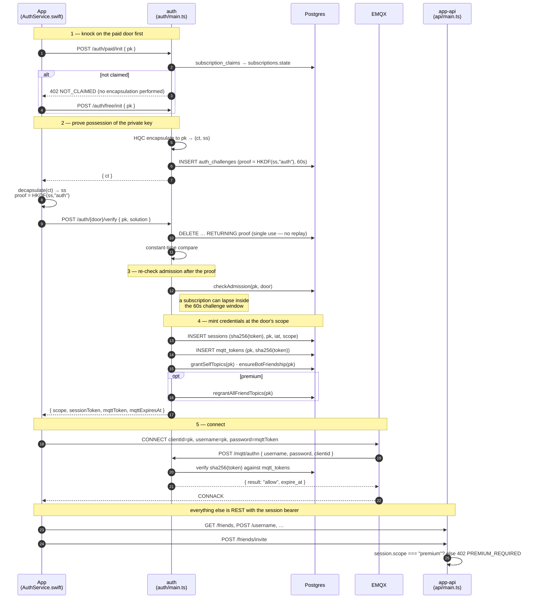
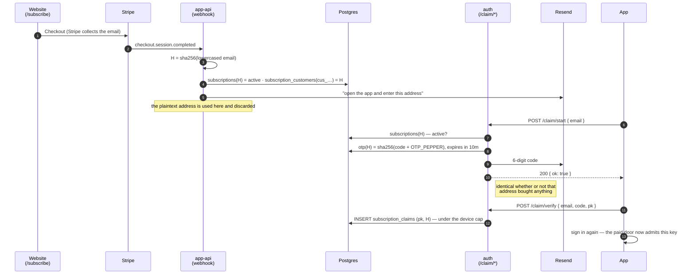

# Authentication

How a client goes from "I hold a private key" to "I have a live MQTT session",
what it is allowed to do when it gets there, and what each component is trusted
with along the way.

Nothing here is a password. Identity is an HQC key pair generated on the device;
the server never sees the private half, and "logging in" means proving you can
decapsulate a ciphertext addressed to your public key.

## Two doors

There are two ways in, and they are separate endpoints rather than one endpoint
with a flag:

| | `/auth/free/*` | `/auth/paid/*` |
|---|---|---|
| Who gets in | anyone holding a key pair | only a key bound to a live subscription |
| Refused with | — | `402 NOT_CLAIMED`, **before** the KEM encapsulation |
| Session scope | `free` | `premium` |
| Can do | talk to the helper bot | everything, including adding contacts |

The paid door answers before doing any work: an unclaimed key costs one
primary-key lookup and never reaches the native HQC library. That is only safe to do because
the free door exists — refusing at the paid door denies nobody access to the
app, so it is a gate rather than a subscriber-status oracle bolted to the only
way in.

The entitlement is decided once, at the door, and **stored in the session**. No
later request re-derives it: `/friends/invite` reads one column, not the
subscription tables and certainly not Stripe.

## The flow

## Claiming a subscription

A subscription is bought on the website and claimed from the app. The two have
nothing in common — one is a Stripe customer, the other an HQC key pair — so an
email address bridges them, and a code sent to it is the only proof accepted
that the person holding the device is the person who paid.

**The server never stores an email address.** Everything is keyed by
`H = sha256(lowercased, trimmed email)`, so a dump of this database says which
subscriptions exist but not whose. Stripe remains the only system holding the
plaintext.

**`OTP_PEPPER` is why the stored hash is worth anything.** A six-digit code has
a million preimages; without a server-side secret in the hash, anyone reading a
database dump inverts every pending code with a for-loop.

## Why it is shaped like this

**Two tokens, two jobs.** The MQTT token (12 h) is the credential that travels as
an MQTT password; the REST session bearer is what lets a client rotate it
*without* touching the private key, which is why a dropped connection does not
cost the user a biometric prompt.

**The MQTT token used to be 5 minutes, and that was a revocation mechanism in
disguise.** With no way to end a live session, the only bound on a revoked client
was how long its token had left — so every client was disconnected and rebuilt
twelve times an hour to keep that bound short (LAT-1). Revocation now acts
directly ([`lib/emqx.ts`](../../services/server/lib/emqx.ts) drops a subscription
or kicks a session), so the TTL means what a credential lifetime should mean: how
long a *stolen* token stays useful.

**The session slides.** Fixed at an hour, it cost a prompt every hour of active
use — the refresh 401'd and the client fell back to a full handshake. Each use now
extends the idle window, with a 30-day absolute cap so a stolen bearer in
continuous use cannot live forever.

**Scope in the session needs revocation that acts.** A `premium` bearer would
otherwise outlive a cancelled subscription by up to its 30-day cap, which is not
a refund policy. `sessions:{pk}` indexes live bearers so the cancellation webhook
can end them, alongside `EMQX.kick` and the friend-topic revocation.

**A lapse revokes topics but never deletes anything.** Friendships and message
history survive; `regrantAllFriendTopics` puts the ACL back on the next paid
login. The free door deliberately does *not* revoke — a client that landed there
because a database read blipped would otherwise tear down every conversation it
has.

**Expiry is enforced by the broker, not by politeness.** `/mqtt/authn` hands EMQX
the token's `expire_at`, and EMQX disconnects the client when it lapses.

**The challenge is consumed atomically** (`GETDEL`), so a captured
`/auth/*/verify` cannot be replayed. There is an optional per-CONNECT nonce on
top for the MQTT leg.

## Components

| Component | Trusted with | Not trusted with |
|---|---|---|
| `AuthService.swift` | the private key, in the Keychain behind biometrics | — |
| `auth/main.ts` | minting scoped tokens, admission, mailing claim codes | reading messages (it never sees one), talking to Stripe |
| `api/main.ts` | the friend graph, the Stripe webhook, the paywall | anything about a session it did not resolve |
| Postgres | token *hashes*, the challenge, the ACL, claim state | plaintext tokens, private keys, email addresses |
| Stripe | the customer's email and card | the crypto identity — no public key is ever sent |
| EMQX | enforcing authn/authz per packet | decrypting payloads |

## Failure modes worth recognising

| Symptom | Usually means |
|---|---|
| `/auth/paid/init` returns 402 `NOT_CLAIMED` | no live subscription for this key — the client falls back to the free door, which is a normal signed-in state |
| `/auth/*/init` returns 403 `NOT_ADMITTED` | an allowlist server that does not want this key. Retrying the other door asks the same question |
| `/friends/invite` returns 402 `PREMIUM_REQUIRED` | a free session. The user must claim a subscription, then sign in again |
| `/claim/start` returns 200 but no code arrives | either that address bought nothing, or mail is failing. The response cannot tell you which — check the server log, which can |
| `/claim/verify` returns `NO_CODE` after wrong guesses | the code was burned at 5 attempts. Request a new one |
| CONNACK returns code 5 (not authorised) | the MQTT token expired or was already consumed — refresh and reconnect |
| `/auth/verify` returns 401 | the challenge expired (60 s) or the device holds the wrong key for that pk |
| `/auth/refresh` returns 401 | the session lapsed — a full handshake is needed, and the user sees a prompt |
| Premium user suddenly cannot message friends | the subscription lapsed and the webhook revoked the topics. Resubscribing restores them on the next paid login |
