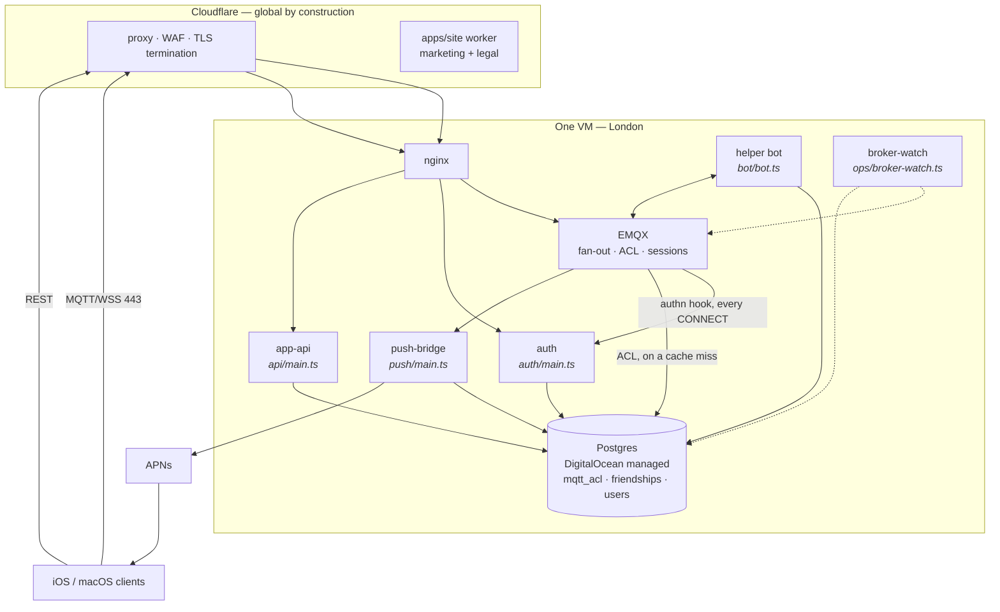
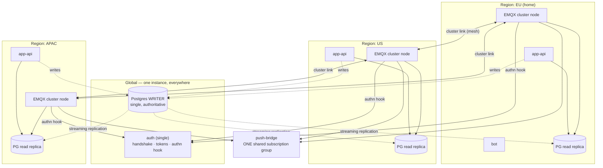

# Components, one region and many

What runs, and how it changes shape when it stops being one box in London.

Two target topologies are documented here, both real: **single region**, which is
what runs today and is the right answer for a long time, and **multi region**,
which is the decided direction when latency outside Europe starts costing users.

---

## Single region (today)

Everything except Cloudflare, APNs and the database is co-located. The database
is a managed cluster in the same region, reached over the VPC's private endpoint
— a hop off the box, but not out of the datacentre — so the only latency that
matters is still the client's round trip to London.
Which is precisely the problem being solved below: a user in Sydney pays ~250 ms
per message on a payload that was cryptographically ready to send instantly.

---

## Multi region (the decided shape)

The reasoning behind each of these is the point — the layout follows from it.

### One global writer, with a streaming replica per region

Postgres holds everything: connect tokens, `mqtt_acl` (read by EMQX on an authz
cache miss), the friend graph, the username directory, sessions and rate
counters.

Local reads are what the replicas are for. Note this is a smaller claim than it
used to be: the ACL read is NOT in front of every message — EMQX caches it for
15m per client-topic — so regional replicas buy locality on directory and friend
reads more than on the authz path.

Writes stay with **one writer**, and not for convenience: a single-use nonce
accepted in two regions at once is a correctness bug, not a race to tune. Writes
are also rare — a friend accept, a username claim, a token mint — and their
latency is invisible next to a message round trip.

The reason the writer does not saturate is **table tiering**, not replication.
The only genuinely hot writes — session sliding and rate counters — are
`UNLOGGED` tables that stay regional and never reach the writer at all. See
[postgres-migration.md](postgres-migration.md).

The cost to accept, explicitly: **replication lag becomes revocation lag**. A
removed ACL row is already up to fifteen minutes stale from EMQX's own cache;
across regions it is that plus replication. Both are survivable for the same
reason: revocation acts through the broker's admin API rather than waiting for
either clock, so the lag only affects a client that reconnects inside the
window.

### One global auth service

`auth` handles the KEM handshake, mints tokens, and answers EMQX's authn hook.

It is **not regionalized**, deliberately. It sits on the CONNECT path, not the
message path — a client connects, then sends thousands of messages — so an extra
100 ms on connect is a cost paid rarely and invisibly, while the complexity of
replicating token state correctly is paid forever. Single-use tokens against
replicas is exactly the class of bug the single writer above exists to avoid.

Consequence to design around: **`auth` is a global dependency of every regional
broker.** If it is slow, connects are slow everywhere. It should be sized for
reconnect storms rather than average load — see **LAT-1** in the
latency audit, where the 5-minute token TTL
means every client reconnects twelve times an hour whether or not it sends
anything.

### EMQX, app-api and the bot cluster per region

Clients connect to the nearest broker; **EMQX Cluster Linking** carries a message
across regions only when a subscriber is actually on the other side. Two people in
Sydney talking to each other never touch London.

The mesh is not free — cross-region links are billable traffic and operational
surface (WireGuard tunnels between droplets, per the sketch in
[`infra/multiregion`](../../infra/multiregion/)) — **and it is worth paying for**,
because it is the only part of the design that removes the ocean from the message
path rather than hiding it.

`app-api` follows the brokers (it reads the local replica and writes home), and
the bot follows too: it is an ordinary MQTT client, so a regional instance
connects to its regional broker.

### The push-bridge stays one shared group

It subscribes as `$share/pushbridge/c/+`. Replicas may be spread across regions —
that is what a shared subscription is for — but they must remain **one group
globally**. Two groups means two regions each independently decide a device is
offline, and the user gets duplicate APNs wakes for one message.

---

## Summary

| Component | Single region | Multi region | Why |
|---|---|---|---|
| Cloudflare, `apps/site` | global | global | workers run at every PoP already |
| APNs | global | global | Apple's |
| **auth** | on the VM | **one global instance** | connect-path only; replicating token state is not worth it |
| **Postgres** | managed cluster, home region | **one writer + a regional read replica** | directory/friend reads local; nonces and claims must have one writer |
| **EMQX** | on the VM | **clustered, one node per region** | the only way to take the ocean out of the message path |
| **app-api** | on the VM | **per region**, reads local / writes home | follows the broker |
| **bot** | on the VM | **per region** | just another MQTT client |
| **push-bridge** | on the VM | replicas, **one shared group** | two groups = duplicate wakes |

## Order of work

1. **EMQX cluster + regional brokers.** This is where the user-visible latency is.
2. **Postgres read replicas** beside each broker, ACL and directory reads local.
3. **app-api and bot** per region, writes still going home.
4. **auth stays where it is** — and gets sized for the reconnect load it will now
   absorb from every region.

## What to measure before any of it

There is no load test for the MQTT architecture (**LAT-4**). Cluster-link traffic,
ACL read volume and reconnect-storm behaviour are all measurable on the existing
compose stack, and every number in the plan above is currently a derivation rather
than an observation.
