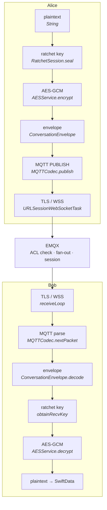

# How a message actually travels

One line of text, from a keystroke on Alice's device to a decrypted row in Bob's
database, naming every function it passes through.

This is the base of the app. Every other feature is a variation on this path, so
it is worth understanding once, properly — including *why* each layer exists,
because several of them look redundant until you know what they replaced.

## The layers

A message is wrapped four times and unwrapped four times. Each layer has exactly
one job and knows nothing about the others.



| Layer | Protects against | Would break if removed |
|---|---|---|
| KEM double ratchet + prekeys | a stolen key reading *past or future* messages | one key compromise exposes the whole conversation |
| AES-256-GCM | reading or tampering with content | the server could read everything |
| `ConversationEnvelope` | ambiguity about who sent what, and about ordering | the receiver could not pick the right ratchet key |
| MQTT + topic ACL | the wrong person subscribing | anyone knowing two public keys reads the conversation |
| TLS + SPKI pinning | network observers and forged origins | metadata (who talks to whom, when) becomes public |

---

## Send

### 1. The view hands off — `ChatView.sendMessage()`
`ChatView.swift:508`

Writes the `Message` row **before** sending, with `deliveryStatus = .sending`. That
ordering is deliberate: the message used to be created only after a successful
send, so a failure left no trace at all — the composer kept the text and the user
got a transport error in an alert with nothing to retry. Now a failed send is a
row with a retry affordance.

Then `deliver(text:messageId:)` does the actual work, and it is shared with
`retrySend` so both paths advance the ratchet identically.

### 2. Take a message key — `RatchetSession.seal(kem:state:)`

Every message gets its own key, off a per-direction chain:

```
mk  = HKDF(ck, "hqchat/v2/msg")   ← this message's key, then forgotten
ck' = HKDF(ck, "hqchat/v2/ck")    ← the chain moves on
```

That one-way step is what gives **forward secrecy**: the chain cannot be run
backwards, so a device compromised later cannot produce the keys for messages
already sent.

`seal` also decides whether this frame performs an **asymmetric step** — a fresh
ratchet keypair plus a ciphertext encapsulated to the peer's current one, which
re-seeds the root. That is what gives **post-compromise security**: an attacker
holding the state stops being able to read anything one step after the users
resume talking. A step costs ~29 kB, so it happens on a direction flip subject to
a rate limit, never on every message ([e2ee-protocol.md](e2ee-protocol.md) §4).

**There is no un-ratcheted path.** v1 had one: `sealKey` returned nil until an
epoch was installed, nothing installed one at establishment, and the send path
fell back to a static per-friend key — so a conversation under 100 messages was
never ratcheted at all. That was tracked as KM-5 and is gone.

If no session exists yet, `seal` is preceded by opening one from the peer's
published prekeys, and this frame carries the handshake (step 4).

### 3. Seal — `AESService.encrypt(plaintext:key:)`
`AESService.swift:21`

AES-256-GCM with a fresh 12-byte nonce, output as base64 of
`[nonce 12][tag 16][ciphertext]`. GCM is authenticated, so a flipped bit is a
decryption *failure*, not a garbled message — the server cannot tamper undetected.

The nonce is random per message and the key is used once (§2), which is what keeps
GCM safe here: nonce reuse under one key is catastrophic for GCM, and a ratchet
that never reuses a key removes the risk structurally rather than by discipline.

### 4. Wrap — `ConversationEnvelopeV2`

```jsonc
{ "v": 2, "t": "msg", "sender": "<my client id — 64 hex>", "msgId": "…",
  "cid": "0123456789abcdef0123456789abcdef",   // which chain `n` counts within
  "n": 17, "pn": 4,
  "payload": "<base64 AES-GCM>" }
```

Two `t` values, not three. `aes` and `key_rotate` are gone: the handshake rides
the first real message as `t: "init"`, which is what lets a conversation start
while the peer is offline.

`sender` is the **client id** — `sha256(lowercase-hex(publicKey))`, exactly 64
hex characters — not the username, because a mutable display name must never
decide which key decrypts a message. It carried the whole 14474-character public
key until `004_identity_by_hash.sql`.

An `init` frame additionally carries `senderPk`, the initiator's full key, so a
responder who has never fetched it can answer without a round trip. It is refused
unless `sha256(hex(senderPk)) == sender`, which is what makes it safe to pin from
a frame that arrived over the network.

Every field except `payload` is bound as **AES-GCM additional authenticated
data**, under a canonical length-prefixed encoding both implementations assert
against a shared vector. The header is what *selects* the key, so it is read
before the payload it selects for can authenticate it; binding it is what makes a
rewritten field produce no message rather than a wrong one. In v1 those fields
rode entirely outside the AEAD, which was the mechanism behind TM-1.

### 5. Address it — `MQTTTopics.conversation(myID, friendID)`
`MQTTService.swift:41`

```swift
let joined = [id1, id2].sorted().joined()
return "c/" + SHA256(joined).hex
```

Sorting is what makes it symmetric — both ends derive the same topic without
agreeing on one. The server computes the identical value in
[`crypto-utils.ts`](../../services/server/lib/crypto-utils.ts), which is how
`grantFriendTopic` knows which ACL entry to write, and the two are pinned against
one another by
[`identity-vectors.json`](../../services/server/test/helpers/identity-vectors.json)
— a cross-implementation vector `001_schema.sql` claimed existed long before it
did.

**This topic name is derivable by anyone who knows both client ids** — and an id
is derivable by anyone holding the corresponding public key. It is not a
secret and was never meant to be. The `mqtt_acl` table is the access control;
see §7.

### 6. Publish — `ChatSession.publish` → `MQTTService.send` → `MQTTWireClient.publish`
`ChatSession.swift:203` ·
`MQTTService.swift:159` ·
`MQTTWireClient.swift:298`

QoS 1, not retained. QoS 1 means the broker must acknowledge; the client keeps the
packet in `unacked` until the PUBACK arrives and re-sends it with the DUP flag
after a reconnect, so a message composed during a network blip is not silently
lost.

Not retained matters too: a retained message would be replayed to anyone who
subscribes later, which for a conversation is wrong. Presence *is* retained, for
the opposite reason.

### 7. Encode and write — `MQTTCodec.publish` → `URLSessionWebSocketTask.send`
`MQTTWireClient.swift:129`

Fixed header (type + QoS + retain flags), variable-length remaining-length varint,
topic, packet id, payload. Then a single binary WebSocket frame over TLS.

The client is hand-rolled (why):
every Swift MQTT library brings its own WebSocket and TLS stack, and the one thing
this app cannot lose is SPKI pinning. Running MQTT over `URLSessionWebSocketTask`
keeps the exact `TLSPinningDelegate` the REST calls use.

---

## The broker

### 8. Authorize — EMQX → Postgres
[`emqx.conf`](../../infra/deploy/emqx/emqx.conf) · [`emqx-acl.md`](emqx-acl.md)

```sql
SELECT action, topic FROM mqtt_acl WHERE id = ${clientid}
--  →  ("all", "c/{hash}") · ("subscribe", "u/{peer}/presence") · ("publish", "u/{peer}/inbox")
```

Run on **every** publish and subscribe, with `no_match = deny` and
`deny_action = disconnect` — behind a **15-minute cache**, so this is not a
per-message query, and a revoked grant survives in a live session for up to that
window (which is why revocation also drops the connection through the admin API).

The rows were written when the friendship was accepted:
[`DB.grantFriendTopic`](../../services/server/services/db/api.ts) writes six —
three per member — in one statement. There is no `hashmembers` set any more;
`friendships.hash` answers that question directly, and `getHashMembers` reads it.

`clientid` is the **client id** — `sha256(lowercase-hex(publicKey))`, 64
characters — fixed at CONNECT by the authn hook, so a client cannot claim
someone else's ACL row. It was the 14474-character public key until the
identifier change, which is what made the revocation call exceed a URI length
limit and fail silently for the whole of this deployment's life (finding SRV-3).

If the ACL says no, the publisher is **disconnected**, not merely refused. From
the app that looks like a dropped connection, which is worth knowing when
debugging ([runbook §2](../runbooks/debugging.md)).

### 9. Fan out

EMQX delivers to every subscriber of `c/{hash}`:

- **Bob's session** — immediately if connected; otherwise the message is held in
  his persistent MQTT session (`clean-session = false`, `clientId = id`) and
  replayed on reconnect. That session *is* the offline queue; there is no
  server-side store any more.
- **The push-bridge**, subscribed as `$share/pushbridge/c/+`
  ([`push/main.ts:77`](../../services/server/push/main.ts)). A *shared*
  subscription, so replicas split the fan-in instead of each sending a push.
- **Alice herself**, because MQTT delivers to every subscriber including the
  publisher — which is why the router drops envelopes whose `sender` is our own pk
  (`ConversationRouter.swift:92`).

### 10. Wake, if needed — the push-bridge
[`push/main.ts:93`](../../services/server/push/main.ts)

```ts
const members = await DB.getHashMembers(hash);
for (const id of members) {
  if (online.has(id)) continue;
  report(id, await ApnsService.send(id, "New message", "You have a new message"));
}
```

The payload is **content-free** — the bridge never decrypts and never could.
Presence comes from the retained `u/{id}/presence` values it tracks in memory.

This is also **LAT-2** in the latency audit:
a store round trip per message, even when everyone is online.

#### The wake decision is made once, and never revisited

There is no retry and no queue behind it. If presence says a device is online at
the moment the message is published, no push is sent for that message — ever,
even though the app was in fact suspended and will not read the socket for
hours. That single property is what turns two otherwise-small faults into "my
phone only buzzes while I am looking at it":

- **The device has to win a race to say it is leaving.** On iOS the socket is
  frozen, not closed, so the app publishes a retained `{"s":"offline"}` from its
  scene-phase handler and holds a `beginBackgroundTask` assertion open so it
  cannot be suspended mid-send. The assertion has to outlive the *write*: for a
  while it did not — `publishPresence` returned as soon as the frame was
  scheduled — so iOS could suspend the app with the frame still in a dispatch
  queue, and the broker went on believing it was reachable until keepalive
  lapsed 45 seconds later. Every message in that window was skipped.
  `MQTTService.publishPresenceAwaitingWrite` closes it; `ProtocolLog` records
  `⚠️ could NOT announce offline` when it still cannot.
- **The bridge has to be able to send.** Every step of `ApnsService.send` used
  to exit silently — no key, no token, no bundle id. It returns a named
  `SendOutcome` now, and the bridge logs `could not wake <id>: <reason>` once per
  account per reason.

Nothing here is a delivery guarantee: the message itself is safe (the recipient's
persistent MQTT session queues it, and it is replayed on reconnect). What is lost
is the *notification*, which is exactly the part the user notices.

#### Only push-bridge holds an opinion about APNs

`APNS_KEY_ID`, `APNS_TEAM_ID` and the topics are non-secret and live in the
shared `server.env`; `APNS_KEY_P8` is a compose secret mounted into
**push-bridge alone**. The all-or-nothing validation therefore runs behind
`assertConfig(["apns"])` and only there. When it ran in every service, auth and
app-api saw two thirds of a config, called it partial, and refused to boot — so
the only configuration that kept the stack running was no APNs at all, which is
a stack that boots cleanly and has never sent a single push.

It **warns**; it does not exit. Push is optional by design and a stack with no
APNs is allowed to run, so exiting on half a config while tolerating none of one
is incoherent — and a crash-looping push-bridge takes out its own health endpoint
and buries its explanation in restart spam, on a box whose operator may need
values from the Apple Developer portal before they can fix it. An *intended* but
broken setup is escalated to `logger.error`, and therefore to Sentry, once.

`npm run check-push -- <username>` reports which step stops, from inside the
container that holds the key.

---

## Receive

### 11. Read the socket — `receiveLoop` → `ingest`
`MQTTWireClient.swift:340`

Bytes go into a rolling buffer, and `MQTTCodec.nextPacket` pulls whole packets off
the front. This buffering is not optional: MQTT-over-WebSocket explicitly allows a
frame to carry a partial packet, several packets, or both. There is a test for
exactly that (`MQTTWireTests.swift`).

### 12. Acknowledge — PUBACK
`MQTTWireClient.swift:368`

A QoS-1 PUBLISH is acknowledged **immediately on parse**, before the app has
decrypted anything. That is a deliberate trade: EMQX stops redelivering as soon as
the bytes are safely received, so a decryption failure does not become an infinite
redelivery loop. The cost is that a message lost between PUBACK and persistence is
gone — which is why the row is written synchronously in §15.

### 13. Route — `MQTTService.handle(.message)` → `ChatSession` → `ConversationRouter.handle`
`MQTTService.swift:174` ·
`ConversationRouter.swift:89`

Topic shape decides: `u/{id}/presence` is presence, `c/…` is a conversation. The
envelope is decoded, our own echo is dropped, and the sender's **public key** is
resolved to a local `Friend` with a SwiftData predicate on the pinned key
(`friend(withPk:)`, line 78).

No friend pinned for that key → the message is discarded. That is the correct,
paranoid behaviour: we will not decrypt for an identity we have not pinned.

### 14. Find the key — `RatchetSession.open(kem:state:header:)`

Three cases, in order:

1. **Cached.** A key kept when this chain was current, for a message that arrived
   late — including one from a chain since retired. Checked first, so a straggler
   resolves without touching live state.
2. **A step.** The header names a chain we are not on and carries the key and
   ciphertext to enter it. Before stepping, the chain we were on is drained up to
   `pn` and its keys cached, so nothing in flight is lost.
3. **Forward on the current chain.** Walk to `n`, caching what was skipped.

Anything else yields no key: a replay (`n` already consumed), a frame naming a
retired chain, a gap past `MAX_SKIPPED`, or a step into a chain already entered.
None of those is an error worth showing a user.

Two bounds matter, and both are about the header being unauthenticated at this
point:

- the walk is refused **before** it runs if the gap exceeds `MAX_SKIPPED` — this
  ran unbounded in v1, so a forged `n` bought two billion HKDF invocations on the
  MainActor (KM-9);
- a chain already stepped into cannot be re-entered, so replaying a real stepping
  frame cannot rewind the root.

### 15. Open and store
`ConversationRouter.swift:108`

`AESService.decrypt` → plaintext → `Message(content:isOutgoing:friend:)` →
`modelContext.insert` → `save()`. The `Message` initializer seals the body at rest
under a per-profile key (`Message.swift`),
so the plaintext exists in memory and in the view, never in the store file — there
is a test asserting the store file does not contain it.

Then `NotificationService.notifyMessage` raises a banner unless that chat is on
screen, and refreshes the unread badges.

---

## The other envelope type

### `init` — opening a session

One frame, carrying a real message. The initiator claims the responder's prekey
bundle from the directory, derives the root locally, and publishes:

```jsonc
{ "v": 2, "t": "init", "sender": "…", "msgId": "…",
  "ctId": "<b64>",       // encapsulated to their PINNED identity key — authenticates
  "ctMt": "<b64>",       // to their medium-term prekey
  "ctOt": "<b64>",       // to a one-time prekey, when one was available
  "otId": 3,             // which one, so they know which secret opens it
  "rk": "<b64>",         // our ratchet key, so they can step when they reply
  "cid": "…", "n": 0, "pn": 0,
  "payload": "<b64 AES-GCM>" }
```

**It goes to the peer's inbox** (`u/{peer}/inbox`), not the conversation topic.
That is about delivery: MQTT drops a publish to a topic nobody has subscribed to,
which is exactly what a brand-new friendship is. Clients subscribe to their own
inbox on connect with `cleanSession = false`, so the broker queues it while they
are offline.

This replaced a two-frame offer/answer exchange that needed both devices online
at once. When it stalled — and it did, whenever the accepting side published into
a topic the inviter had not subscribed to yet — both contacts sat at "setting up"
with no way for either to tell which half was missing. The client carried a 15s
directory poll, an exponential offer backoff and a re-offer rule to paper over
it. All of that is deleted.

### The graph is pushed, not only polled

A client learns the friend graph by calling `/friends`, and nothing used to tell
it when to. The poll runs every 60 seconds, which made two things fail in ways
that looked unrelated: an invite did not appear until the recipient refreshed by
hand, and an `init` from a freshly accepted contact could arrive at the inviter
before their directory held the sender's client id — so the frame named nobody
they knew and was dropped, and the message only surfaced later as a side effect
of the recipient sending something of their own.

`/friends/{invite,accept,cancel,remove}` now publish `{"t":"graph"}` to each
affected account's `u/{id}/graph` through the EMQX admin API, and the client
answers by pulling the directory. The poll stays underneath as the floor: a
nudge is best-effort, and a client that was offline for one still has to find
out. See `docs/architecture/emqx-acl.md` for why the topic is subscribe-only and
why the nudge carries no graph content.

The handshake rides **every** outbound frame until the peer answers, not just the
first. Clearing it on send would lose it whenever a publish failed or a send was
retried, and the retry would name a session the peer had never been told about.

### What is NOT accepted

An `init` for a conversation that already has a session is **ignored**. That is
the difference between "my peer reinstalled" and "somebody replayed a frame to
wipe my conversation", and nothing on the receiving side can tell them apart.

A peer who really did reinstall holds a new key, hence a new client id, hence a
different contact row — so they could not reach this session at all. The old
identity is marked *vanished* by the directory sync rather than re-keyed in place
(see e2ee-protocol.md §2).

## Where it breaks, by layer

| Symptom | Layer | Look at |
|---|---|---|
| Sender's connection drops on send | 8 — ACL | `scripts/check-mqtt-acl.ts <user>` |
| Delivered to some devices only | 9 — session | per-device `clientId` / clean-session |
| Arrives in a burst after opening the app | 9 — session replay | working as designed |
| No push while backgrounded, ever | 10 — APNs config | `scripts/check-push.ts <user>` |
| No push while backgrounded, sometimes | 10 — presence | retained `u/{id}/presence` stuck online |
| Arrives, nothing appears | 13 — routing | "no friend pinned" — directory sync |
| Arrives, nothing appears | 14 — ratchet | "no key for … (cid …, n …)" |

Full procedure: [debugging runbook](../runbooks/debugging.md).
