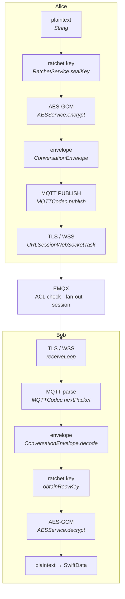

# How a message actually travels

One line of text, from a keystroke on Alice's device to a decrypted row in Bob's
database, naming every function it passes through.

This is the base of the app. Every other feature is a variation on this path, so
it is worth understanding once, properly — including *why* each layer exists,
because several of them look redundant until you know what they replaced.

## The layers

A message is wrapped four times and unwrapped four times. Each layer has exactly
one job and knows nothing about the others.



| Layer | Protects against | Would break if removed |
|---|---|---|
| Double ratchet | a stolen key reading *past or future* messages | one key compromise exposes the whole conversation |
| AES-256-GCM | reading or tampering with content | the server could read everything |
| `ConversationEnvelope` | ambiguity about who sent what, and about ordering | the receiver could not pick the right ratchet key |
| MQTT + topic ACL | the wrong person subscribing | anyone knowing two public keys reads the conversation |
| TLS + SPKI pinning | network observers and forged origins | metadata (who talks to whom, when) becomes public |

---

## Send

### 1. The view hands off — `ChatView.sendMessage()`
`ChatView.swift:508`

Writes the `Message` row **before** sending, with `deliveryStatus = .sending`. That
ordering is deliberate: the message used to be created only after a successful
send, so a failure left no trace at all — the composer kept the text and the user
got a transport error in an alert with nothing to retry. Now a failed send is a
row with a retry affordance.

Then `deliver(text:messageId:)` does the actual work, and it is shared with
`retrySend` so both paths advance the ratchet identically.

### 2. Take a message key — `RatchetService.sealKey(&state)`
`RatchetService.swift:129`

```swift
let mk = messageKey(cur.sendCK)        // HKDF(chainKey, "msg")
cur.sendCK = chainNext(cur.sendCK)     // HKDF(chainKey, "ck") — chain moves forward
cur.sendIdx += 1
return (mk, epoch, idx)
```

Two HKDF derivations from the same chain key, with different `info` labels: one
becomes the message key, the other becomes the *next* chain key. The old chain key
is then gone. That one-way step is what gives **forward secrecy** — a device
compromised now cannot derive the keys that already went past.

`epoch` and `idx` are returned because the receiver needs them to find the same
key. They travel in the clear (see §4), and they have to: you cannot decrypt the
header that tells you which key to use.

**At epoch 0** this returns `nil` and `deliver` falls back to the static
per-friend channel key from the KEM handshake. That path has no forward secrecy —
tracked as **KM-5** in the audits.

### 3. Seal — `AESService.encrypt(plaintext:key:)`
`AESService.swift:21`

AES-256-GCM with a fresh 12-byte nonce, output as base64 of
`[nonce 12][tag 16][ciphertext]`. GCM is authenticated, so a flipped bit is a
decryption *failure*, not a garbled message — the server cannot tamper undetected.

The nonce is random per message and the key is used once (§2), which is what keeps
GCM safe here: nonce reuse under one key is catastrophic for GCM, and a ratchet
that never reuses a key removes the risk structurally rather than by discipline.

### 4. Wrap — `ConversationEnvelope`
`ConversationRouter.swift:24`

```json
{ "type": "message", "sender": "<pk hex>", "payload": "<base64>",
  "messageId": "…", "epoch": 3, "idx": 17 }
```

The whole client↔client protocol is this struct with three `type` values —
`message`, `aes`, `key_rotate`. Compare that to the ~40 message types the old `/ws`
protocol carried; the difference is that routing, presence and the friend graph
are no longer this layer's problem.

`sender` is the **public key**, not a username. The old protocol keyed everything
on usernames because the server resolved them; MQTT has no such mediator, and a
display name a user can change must never decide which key decrypts a message.

### 5. Address it — `MQTTTopics.conversation(myPk, friendPk)`
`MQTTService.swift:41`

```swift
let joined = [pk1, pk2].sorted().joined()
return "c/" + SHA256(joined).hex
```

Sorting is what makes it symmetric — both ends derive the same topic without
agreeing on one. The server computes the identical value in
[`crypto-utils.ts:13`](../../services/server/lib/crypto-utils.ts), which is how
`grantFriendTopic` knows which ACL entry to write.

**This topic name is derivable by anyone who knows both public keys.** It is not a
secret and was never meant to be. The `mqtt_acl` table is the access control;
see §7.

### 6. Publish — `ChatSession.publish` → `MQTTService.send` → `MQTTWireClient.publish`
`ChatSession.swift:203` ·
`MQTTService.swift:159` ·
`MQTTWireClient.swift:298`

QoS 1, not retained. QoS 1 means the broker must acknowledge; the client keeps the
packet in `unacked` until the PUBACK arrives and re-sends it with the DUP flag
after a reconnect, so a message composed during a network blip is not silently
lost.

Not retained matters too: a retained message would be replayed to anyone who
subscribes later, which for a conversation is wrong. Presence *is* retained, for
the opposite reason.

### 7. Encode and write — `MQTTCodec.publish` → `URLSessionWebSocketTask.send`
`MQTTWireClient.swift:129`

Fixed header (type + QoS + retain flags), variable-length remaining-length varint,
topic, packet id, payload. Then a single binary WebSocket frame over TLS.

The client is hand-rolled (why):
every Swift MQTT library brings its own WebSocket and TLS stack, and the one thing
this app cannot lose is SPKI pinning. Running MQTT over `URLSessionWebSocketTask`
keeps the exact `TLSPinningDelegate` the REST calls use.

---

## The broker

### 8. Authorize — EMQX → Postgres
[`emqx.conf`](../../infra/deploy/emqx/emqx.conf) · [`emqx-acl.md`](emqx-acl.md)

```
HGETALL mqtt_acl:{clientid}     →  { "c/{hash}": "all", "u/{pk}/presence": "subscribe" }
```

Run on **every** publish and subscribe, with `no_match = deny` and
`deny_action = disconnect`. The entry was written when the friendship was accepted
— [`DB.grantFriendTopic`](../../services/server/services/db/api.ts) at `api.ts:514`
writes both members' ACL rows and the `hashmembers:{hash}` set in one pipeline.

`clientid` is the public key, fixed at CONNECT by the authn hook, so a client
cannot claim someone else's ACL row.

If the ACL says no, the publisher is **disconnected**, not merely refused. From
the app that looks like a dropped connection, which is worth knowing when
debugging ([runbook §2](../runbooks/debugging.md)).

### 9. Fan out

EMQX delivers to every subscriber of `c/{hash}`:

- **Bob's session** — immediately if connected; otherwise the message is held in
  his persistent MQTT session (`clean-session = false`, `clientId = pk`) and
  replayed on reconnect. That session *is* the offline queue; there is no
  server-side store any more.
- **The push-bridge**, subscribed as `$share/pushbridge/c/+`
  ([`push/main.ts:77`](../../services/server/push/main.ts)). A *shared*
  subscription, so replicas split the fan-in instead of each sending a push.
- **Alice herself**, because MQTT delivers to every subscriber including the
  publisher — which is why the router drops envelopes whose `sender` is our own pk
  (`ConversationRouter.swift:92`).

### 10. Wake, if needed — the push-bridge
[`push/main.ts:93`](../../services/server/push/main.ts)

```ts
const members = await DB.getHashMembers(hash);
for (const pk of members) {
  if (online.has(pk)) continue;
  ApnsService.send(pk, "New message", "You have a new message");
}
```

The payload is **content-free** — the bridge never decrypts and never could.
Presence comes from the retained `u/{pk}/presence` values it tracks in memory.

This is also **LAT-2** in the latency audit:
a store round trip per message, even when everyone is online.

---

## Receive

### 11. Read the socket — `receiveLoop` → `ingest`
`MQTTWireClient.swift:340`

Bytes go into a rolling buffer, and `MQTTCodec.nextPacket` pulls whole packets off
the front. This buffering is not optional: MQTT-over-WebSocket explicitly allows a
frame to carry a partial packet, several packets, or both. There is a test for
exactly that (`MQTTWireTests.swift`).

### 12. Acknowledge — PUBACK
`MQTTWireClient.swift:368`

A QoS-1 PUBLISH is acknowledged **immediately on parse**, before the app has
decrypted anything. That is a deliberate trade: EMQX stops redelivering as soon as
the bytes are safely received, so a decryption failure does not become an infinite
redelivery loop. The cost is that a message lost between PUBACK and persistence is
gone — which is why the row is written synchronously in §15.

### 13. Route — `MQTTService.handle(.message)` → `ChatSession` → `ConversationRouter.handle`
`MQTTService.swift:174` ·
`ConversationRouter.swift:89`

Topic shape decides: `u/{pk}/presence` is presence, `c/…` is a conversation. The
envelope is decoded, our own echo is dropped, and the sender's **public key** is
resolved to a local `Friend` with a SwiftData predicate on the pinned key
(`friend(withPk:)`, line 78).

No friend pinned for that key → the message is discarded. That is the correct,
paranoid behaviour: we will not decrypt for an identity we have not pinned.

### 14. Find the key — `RatchetService.obtainRecvKey(&state, epoch:idx:)`
`RatchetService.swift:140`

Three cases, in order:

1. **Cached** — a key derived earlier for a message that arrived out of order.
2. **Ahead of the chain** — ratchet forward to `idx`, caching every key skipped on
   the way. This is what makes out-of-order and offline-burst delivery work: the
   backlog replayed after a reconnect is rarely in order.
3. **Behind `recvIdx` and not cached** — already consumed. Returns `nil`; the
   message is dropped rather than decrypted twice.

The skipped cache is bounded (`MAX_SKIPPED`), because an attacker who could make
you buffer unbounded keys would have a memory-exhaustion primitive.

`state.prev` keeps one previous epoch, receive-only: during a rotation the peer may
still send under the old epoch for a moment, and dropping those would lose messages.

### 15. Open and store
`ConversationRouter.swift:108`

`AESService.decrypt` → plaintext → `Message(content:isOutgoing:friend:)` →
`modelContext.insert` → `save()`. The `Message` initializer seals the body at rest
under a per-profile key (`Message.swift`),
so the plaintext exists in memory and in the view, never in the store file — there
is a test asserting the store file does not contain it.

Then `NotificationService.notifyMessage` raises a banner unless that chat is on
screen, and refreshes the unread badges.

---

## The other two envelope types

`aes` and `key_rotate` ride the identical path — same topic, same ACL, same
transport — and are handled at
`ConversationRouter.swift:146`
and `:176`. They carry HQC-KEM ciphertexts rather than message content:

- **`aes`** — first contact. Each side encapsulates to the other's public key and
  publishes the ciphertext; both derive the same channel key from the two shared
  secrets. Neither side's contribution ever exists on the server.
- **`key_rotate`** — a Tier-1 epoch change, triggered every `ROTATE_AFTER_MESSAGES`
  by `noteMessageSentAndMaybeRotate`
  (`FriendService.swift:109`) or manually. Symmetric: each side sends exactly one
  seed for the epoch, so simultaneous rotation needs no tie-break.

That these use the same channel as messages is the point. There is no
key-management side channel for an attacker to target separately, and no server
involvement to compromise.

## Where it breaks, by layer

| Symptom | Layer | Look at |
|---|---|---|
| Sender's connection drops on send | 8 — ACL | `HGETALL mqtt_acl:{pk}` |
| Delivered to some devices only | 9 — session | per-device `clientId` / clean-session |
| Arrives in a burst after opening the app | 9 — session replay | working as designed |
| No push while backgrounded | 10 — presence | retained `u/{pk}/presence` stuck online |
| Arrives, nothing appears | 13 — routing | "no friend pinned" — directory sync |
| Arrives, nothing appears | 14 — ratchet | "no ratchet key for epoch N" |

Full procedure: [debugging runbook](../runbooks/debugging.md).
